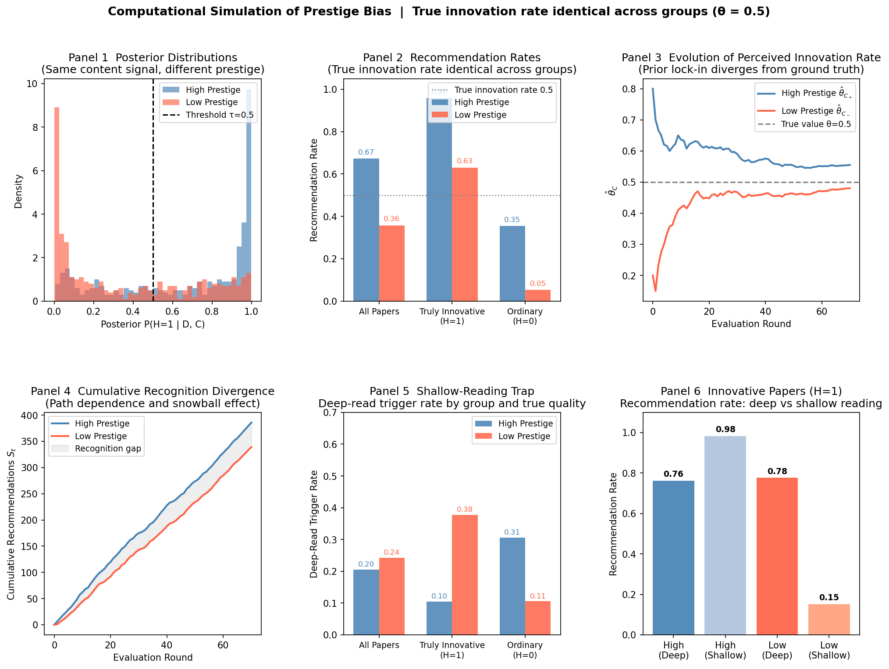

# Technical Section

*Yanjing Li*

## Step 1: Bayesian Updating

When a reviewer encounters a paper, they do not know whether it is genuinely highly innovative.
We denote the paper's latent innovativeness as $H$, where $H=1$ indicates high innovativeness and $H=0$ indicates ordinariness. Reviewers observe two types of information: the paper's text, theoretical contribution, methodological design, and quality of evidence, denoted $D$; and the author's identity or institutional prestige, denoted $C$.

#### Hierarchical Bayesian Model

The prior $P(H=1 \mid C)$ is learned from historical review records. Let $\theta_C$ denote the perceived innovation rate for authors at prestige level $C$, with $\mathrm{Beta}(\alpha, b)$ as the initial prior ($\alpha=b=1$ corresponds to an uninformative starting point). After accumulating $n_C$ historical observations, of which $k_C$ were judged innovative, updating yields:

$$\theta_C \mid k_C, n_C \sim \mathrm{Beta}(\alpha + k_C,\; b + n_C - k_C), \qquad \mathbb{E}[\theta_C] = \frac{\alpha + k_C}{\alpha + b + n_C} \tag{2,\,3}$$

This expectation serves as the prior $P(H=1 \mid C)$, fed into Bayesian updating. Assuming the likelihood $P(D \mid H)$ is independent of prestige (a simplifying assumption: all prestige effects operate through the prior), the reviewer's posterior judgment on a single paper is:

$$P(H=1 \mid D, C) = \frac{P(D \mid H=1)\, P(H=1 \mid C)}{P(D \mid H=1)\, P(H=1 \mid C) + P(D \mid H=0)\, P(H=0 \mid C)} \tag{1}$$

$\theta_C$ is learned from historical data, the prior for a single paper is derived from $\theta_C$, and $\theta_C$ itself is continuously updated by new review outcomes. When historical data have been generated under bias, this structure encodes inequality into the prior and perpetuates itself.

This paper does not consider the "halo effect," whereby identical content is interpreted as innovative under a high-prestige author's name but as immature under a low-prestige author's name. Incorporating this would require rewriting as $P(D \mid H, C)$; retaining the current simplification means this framework provides a conservative estimate of prestige effects.

## Step 2: Evaluation Decision

The attention problem in scientific evaluation involves two interrelated decisions. A reviewer first decides how much cognitive effort to invest in a paper, then decides whether to recommend it based on the posterior formed.

#### Threshold Model

Having formed the posterior $P(H=1 \mid D, C)$, the reviewer compares it against a decision threshold $\tau$ and issues a positive recommendation if and only if the posterior exceeds the threshold:

$$\text{Recommend} \iff P(H=1 \mid D, C) > \tau \tag{5}$$

Since prestige affects the posterior through the prior (Eq. 1), the same paper content $D$ yields different posteriors under different prestige levels. Let $C_+$ and $C_-$ denote high and low prestige respectively:

$$P(H=1 \mid D, C_+) > P(H=1 \mid D, C_-) \tag{6}$$

There therefore exists a range of content values such that $P(H=1 \mid D, C_+) > \tau \geq P(H=1 \mid D, C_-)$, i.e., an identical paper is recommended under a high-prestige author but rejected under a low-prestige author.
If prestige additionally lowers the threshold $\tau$ applied to high-prestige authors, the bias compounds further. But the prior shift alone is sufficient to produce systematic inequality.

#### The Shallow-Reading Trap

Genuinely innovative papers often require deep processing to be recognized, because their contributions frequently lie in the repositioning of existing literature, challenges to prevailing assumptions, or methodological details not easily captured by surface reading. Suppose the reviewer can choose between two processing depths, i.e., shallow reading (observing surface features $D_s$, lower signal-to-noise ratio) and deep reading (additionally observing deep content $D_d$, higher signal-to-noise ratio). Deep reading improves posterior precision but incurs greater cognitive cost.

The preliminary posterior after shallow reading, $P(H=1 \mid D_s, C)$, places the paper into one of three regions: if the posterior already exceeds $\tau + \delta$ (acceptance region), the reviewer recommends directly; if the posterior falls below $\tau - \delta$ (rejection region), the reviewer rejects directly; deep reading is triggered only when the posterior falls in $[\tau - \delta,\, \tau + \delta]$ (the uncertainty region).

The mechanism of the shallow-reading trap: the low-prestige prior $P(H=1 \mid C_-)$ is lower, so even when shallow-read content signals lean innovative, the preliminary posterior often falls into the rejection region rather than the uncertainty region, causing the paper to be terminated outright, never reaching the threshold that would trigger deep reading. By contrast, the high-prestige prior $P(H=1 \mid C_+)$ is higher; the same content signal more readily pushes the preliminary posterior into the acceptance region, allowing the reviewer to recommend without deep reading. Low-prestige papers exhaust their chances of entering the uncertainty region before they ever reach the rejection boundary.

#### Connection to Bai, 2022

The Thompson Sampling model of Bai et al. (2022) provides a structurally analogous reference point. The logic of the two frameworks is similar: locally rational individual decisions generate global inequality at the macro level.

However, the formal mechanisms by which bias is triggered differ. In their experiment, participants actively choose which group to interact with, and bias arises from concentrated exploration of the higher-mean group, i.e., a "which to choose" problem. In scientific evaluation, reviewers are typically assigned papers; the key decisions are "how deeply to engage with a given paper" and "whether the posterior exceeds the recommendation threshold $\tau$."

## Step 3: Cumulative Advantage and Path Dependence

Scientific evaluation is a continuous social process. A recommendation, citation, or share increases a paper's visibility; higher visibility then becomes a new social signal available to subsequent reviewers. Let $S_t$ denote a paper's social signal at time $t$. Each time a reviewer chooses to read deeply and takes a recommending action in Step 2, $S_t$ is updated:

$$S_{t+1} = S_t + \mathbb{I}(A_t^* = \text{recommend or cite}) \tag{7}$$

Subsequent reviewers, when forming their posterior judgments, incorporate not only the current estimate of $\theta_C$ but also $S_t$ as additional social evidence in the prior update; their judgment can be further expressed as:

$$P(H=1 \mid D, C, S_t) \tag{8}$$

## Computational Simulation Verification

To test the internal consistency of the framework above, I ran an agent-based simulation with the following parameters. Content signals are modeled as Gaussian: $D \mid H \sim \mathcal{N}(\mu_H,\, \sigma)$ ($\mu_{H=1}=0.70$, $\mu_{H=0}=0.30$, $\sigma=0.20$); high-prestige prior $\theta_{C_+}=0.80$; low-prestige prior $\theta_{C_-}=0.20$; decision threshold $\tau=0.5$; and the true innovation rate for both groups is set to $\theta=0.5$ (null hypothesis: no difference between groups).

#### Threshold Model (Simulation 1)

Across 800 papers with identical content, the recommendation rate for high-prestige authors was 0.672 and for low-prestige authors 0.357, a difference of $+0.315$. For genuinely innovative papers ($H=1$), the high-prestige recommendation rate was 0.957 versus 0.630 for low-prestige, meaning roughly 1 in every 3 genuinely innovative low-prestige papers is systematically missed.

#### Shallow-Reading Trap (Simulation 3)

Introducing two-stage reading (shallow noise $\sigma_s=0.38$, deep noise $\sigma_d=0.20$, uncertainty band $\delta=0.15$): only 10.4% of high-prestige innovative papers triggered deep reading (high prior pushes the post-shallow posterior directly into the acceptance region); 37.8% of low-prestige innovative papers triggered deep reading (lower prior means content signals push the posterior into the uncertainty region), and once deep reading occurs, the recommendation rate reaches 0.776. However, 62.2% of low-prestige innovative papers fall into the rejection region at the shallow-reading stage (recommendation rate only 0.152), never reaching the threshold that triggers deep reading. The problem for low-prestige innovative papers is not a lack of need for deep reading, but a lack of opportunity to enter the uncertainty region.

#### Cumulative Advantage (Simulation 2)

After 70 rounds of dynamic updating, the perceived innovation rate $\hat{\theta}_{C_+}$ for the high-prestige group converged to 0.555, and $\hat{\theta}_{C_-}$ for the low-prestige group converged to 0.480 (true value 0.5 for both). Cumulative recommendations were 386 (55.1%) versus 339 (48.4%), with the gap growing monotonically across rounds.

**Figure:** Computational simulation results of prestige bias (true innovation rate identical for both groups, $\theta = 0.5$). **Panel 1**: The same content signal produces different posterior distributions under high vs. low prestige, separated by threshold $\tau=0.5$. **Panel 2**: Recommendation rate comparison, i.e., high prestige 0.672 vs. low prestige 0.357; miss rate gap for $H=1$ is 0.327. **Panel 3**: Dynamic evolution of perceived innovation rate $\hat{\theta}_C$; the low-prestige group persistently falls below the true value. **Panel 4**: Cumulative recommendations $S_t$ diverge monotonically across rounds. **Panel 5**: The shallow-reading trap — low-prestige innovative papers ($H=1$) trigger deep reading at a higher rate (0.378) than high-prestige papers (0.104), but most have already fallen into the rejection region at the shallow-reading stage. **Panel 6**: Once deep reading is triggered, the recommendation rate for low-prestige innovative papers (0.776) approaches the high-prestige level (0.762); the problem is that most never reach the deep-reading threshold (shallow-read recommendation rate only 0.152).

#### Conclusion

Even when all papers are equally innovative in truth, as long as initial priors differ by prestige,
the threshold decision mechanism causes high-prestige authors' papers to more readily exceed the recommendation threshold,
thereby accumulating higher $S_t$. Prestige bias does not depend on real differences in paper quality.

Which authors ultimately accumulate citation advantages may partly depend on early, contingent recommendation or exposure events rather than the true innovativeness of their work. Arbitrarily small early differences, amplified through the attention-concentration and $S_t$ feedback loop, can snowball into persistent inequalities in recognition.
